# Assignment 1 - ReactJS app.

Name: [QI ZENG]

### Features.
[ A bullet-point list of the __new features__ you added to the Movies Fan app (and any modifications to existing features) .]
 
+ Feature 1 - New Top Rated Page, shows top reted movies, included movie details, similar movies and reviews.
+ Feature 2 - New Now Playing Page, shows now playing movies, included movie details and reviews.
+ Feature 3 - New Popular Page, shows popular movies, included movie details and reviews.
+ Feature 4 - New Actors Page, shows popular actors, included filter and actors details.
+ Feature 5 - New Login and Sign up Pages, allows user login and sign up. Firebase authentication.
+ Feature 6 - New Similar Movies Pages, shows similar movies and movie details and reviews.

## Setup requirements.

npm install

npm install bootstrap

npm install react-bootstrap

npm install firebase

npm run storybook

## API endpoints.

[ List the __additional__ TMDB endpoints used, giving the description and pathname for each one.] 

+ https://api.themoviedb.org/3/movie/top_rated - get top rated movies
+ https://api.themoviedb.org/3/movie/now_playing - get now playing movies
+ https://api.themoviedb.org/3/movie/${id}/similar - get similar movies
+ https://api.themoviedb.org/3/person/${id} - get detail of actor
+ https://api.themoviedb.org/3/person/${id}/images - get image of actor
+ https://api.themoviedb.org/3/person/popular - get popular people list
+ https://api.themoviedb.org/3/movie/popular - get popular movies

### Component catalogue.

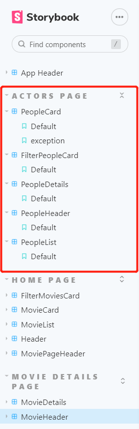

### UI Design.

[ Insert screenshots of the __new/modified app pages__ you developed (and modified existing pages), Include an appropriate caption for each one.

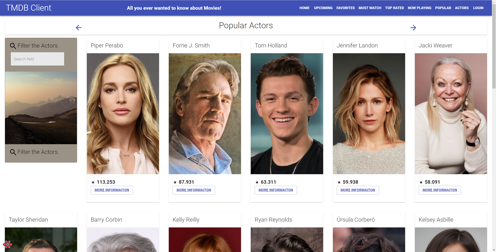

>Shows popular actors.

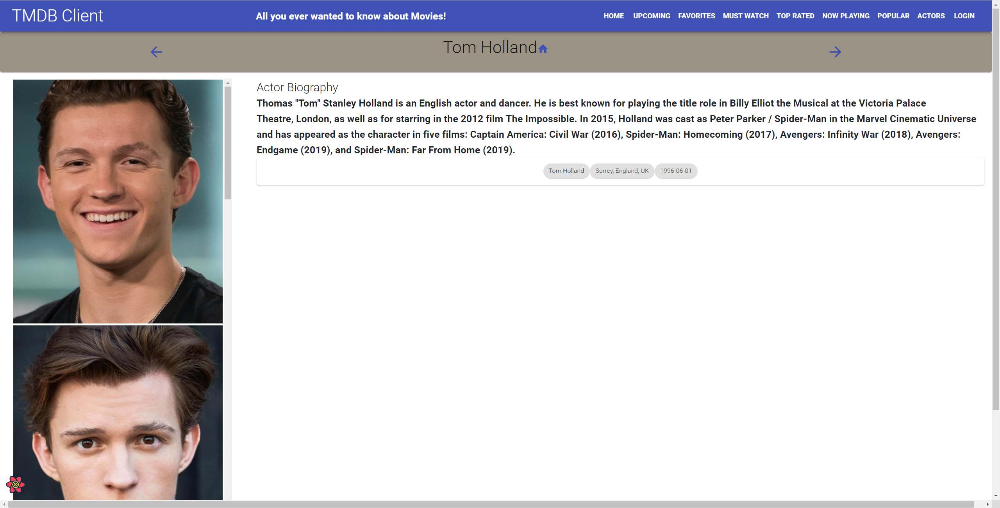

>Shows detailed information of actor.

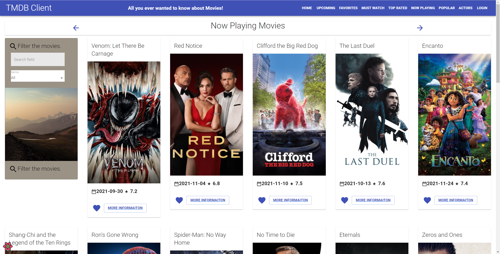

>Shows now playing movies list.

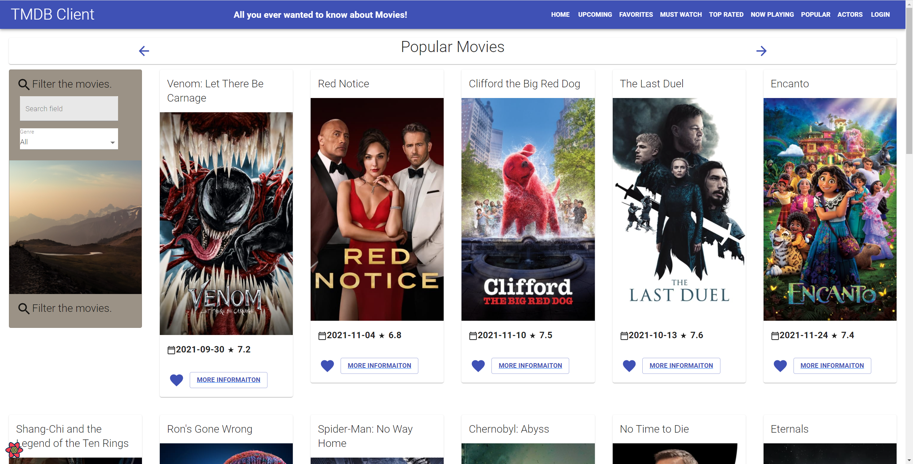

>Shows popular movies list.

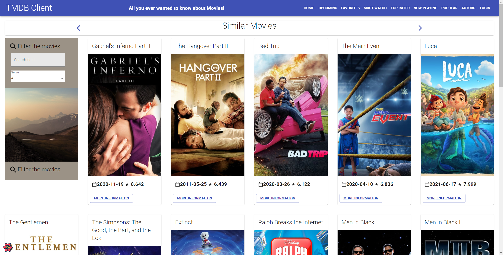

>Shows similar movies list.

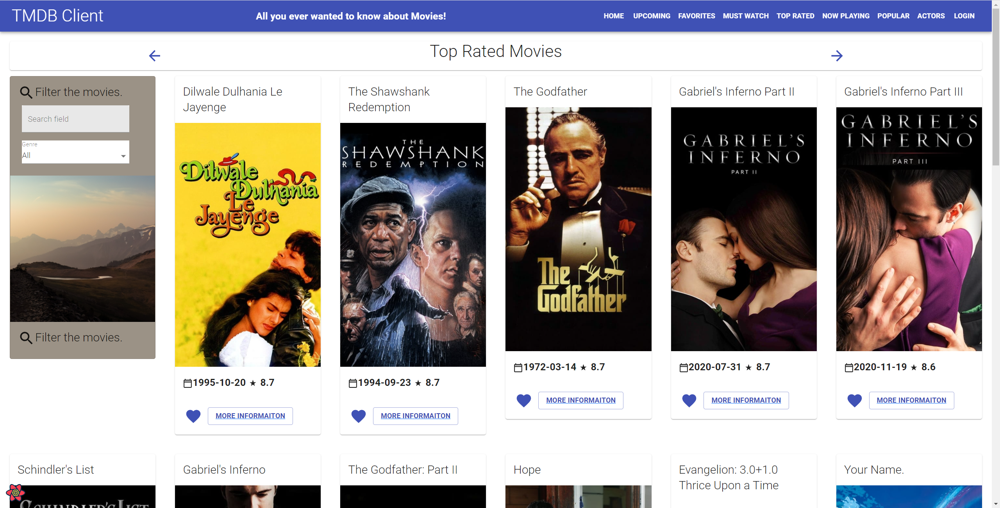

>Shows top rated movies list.

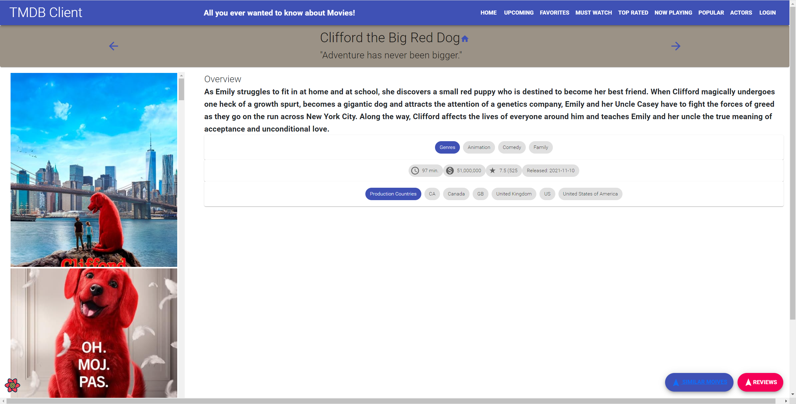

>Shows detailed information of movie.

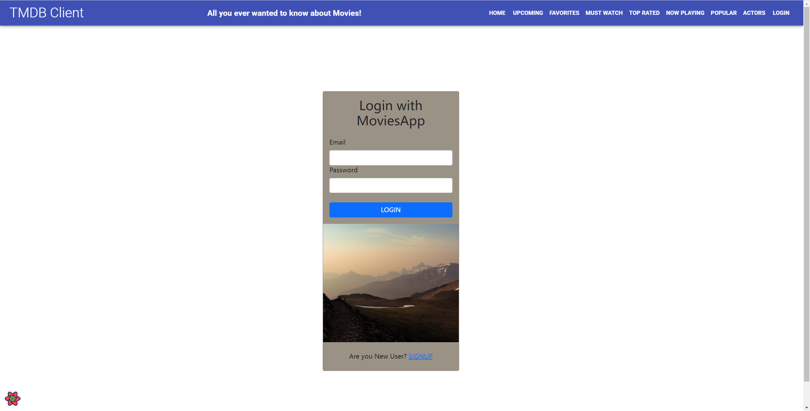

>Shows user login page.

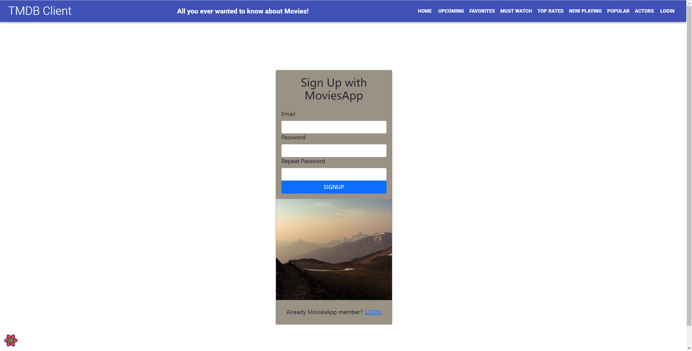

>Shows user sign up page.

### Routing.

[ List the __new routes__ supported by your app and state the associated page.]

+ "/signUp" - displays sign up function.
+ "/logIn" - displays login function.
+ "/people/:id" - detail view of a actor by id.
+ "/similar/:id" - displays similar movies by current movie type.
+ "/movies/popular" - displays popular movie list.
+ "/popular/people" - displays popular actor list.
+ "/movies/nowplaying" - displays now playing movie list.
+ "/movies/toprated" - displays top rated movie list.

[If relevant, state what aspects of your app are protected (i.e. require authentication) and what is public.]

Login and SignUp. Firebase authentication.

## Independent learning (If relevant).

https://firebase.google.com/docs/web/setup?authuser=0

# Assignment 1 - Agile Software Practice

## Overview

Testing ReactJS App.

## E2E Testing

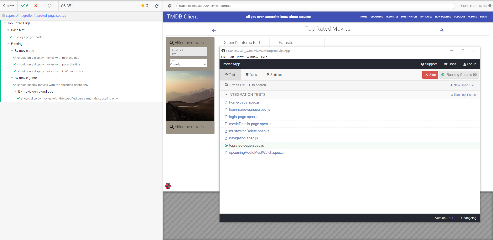

>Tesing Top Rated Page.

## Bundling & Code Splitting

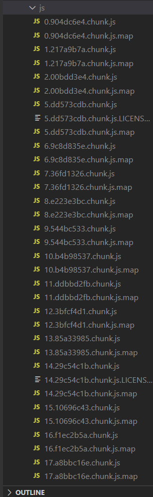

>App Bundling.

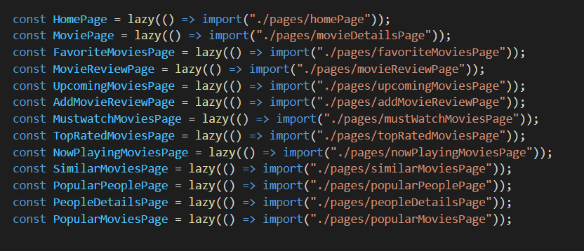

>Code splitting.

## Bundling & Code Splitting

>https://gitlab.com/IvanZeng1/moviesapp-ca-ci/-/pipelines
